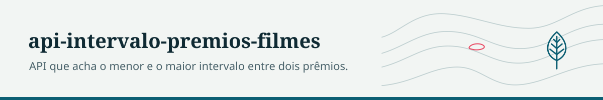
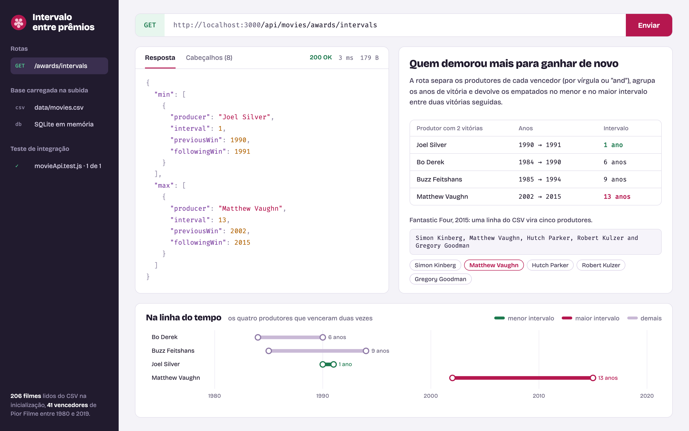

<picture>
  <source media="(prefers-color-scheme: dark)" srcset="docs/marca/cabecalho-escuro.svg">
  
</picture>

# api-intervalo-premios-filmes

API REST que lê a lista de indicados e vencedores do Golden Raspberry Awards (categoria Pior Filme) a partir de um CSV e responde quais produtores tiveram o menor e o maior intervalo entre dois prêmios consecutivos.



Exercício técnico de backend em Node.js. O objetivo era mostrar organização em camadas, carga de dados na subida e um teste de integração que confere o resultado contra o próprio arquivo de entrada.

## Como funciona

1. Na inicialização, `src/utils/populateDatabase.js` cria a tabela `movies` num SQLite em memória e carrega `data/movies.csv` (separador `;`).
2. `GET /api/movies/awards/intervals` busca os filmes vencedores, separa os produtores (por vírgula ou "and"), agrupa os anos de vitória por produtor e calcula os intervalos entre vitórias consecutivas.
3. A resposta traz todos os produtores empatados no menor e no maior intervalo.

```
src/
  controllers/   entrada HTTP
  services/      leitura do CSV e cálculo dos intervalos
  repositories/  consultas ao SQLite
  db/            conexão e criação da tabela
  routes/        rotas do Express
tests/
  integration/   teste ponta a ponta com Supertest
  data/          CSV reduzido usado no teste
```

## Stack

Node.js 18+, Express 4, sqlite3 (em memória), csv-parser, Jest e Supertest.

## Como rodar

```bash
npm install
npm start            # sobe em http://localhost:3000
```

Para usar outro arquivo, substitua `data/movies.csv` mantendo o cabeçalho `year;title;studios;producers;winner`.

Exemplo de resposta com o CSV incluído:

```json
{
  "min": [{ "producer": "Joel Silver", "interval": 1, "previousWin": 1990, "followingWin": 1991 }],
  "max": [{ "producer": "Matthew Vaughn", "interval": 13, "previousWin": 2002, "followingWin": 2015 }]
}
```

## Testes

```bash
npm test
```

Um teste de integração (`tests/integration/movieApi.test.js`): carrega o CSV de teste no banco, chama o endpoint e compara a resposta com o resultado calculado a partir do arquivo. Última execução: 1 de 1 passando.

## Status

Concluído como exercício. Não há persistência fora da memória nem paginação; o CSV é carregado inteiro a cada subida.

## Licença

MIT.
